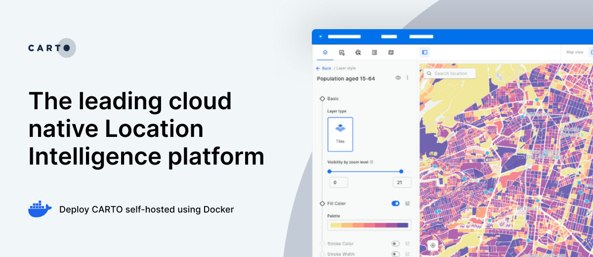

# CARTO Self-hosted for Docker Compose

This repository contains the Docker Compose configuration for CARTO self-hosted used to deploy CARTO in Docker environments.

For a Kubernetes flavor of CARTO, please refer to <https://github.com/CartoDB/carto-selfhosted-helm>

Documentation and instructions can be found at <https://docs.carto.com/carto-self-hosted/overview>

## Release notes

Release notes are available at <https://docs.carto.com/carto-self-hosted/release-notes>
