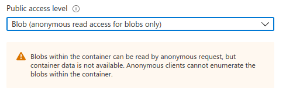

# Cloud Bucket configuration

Supported Cloud Providers:

* **gcp**: [Google Storage](#google-storage) _default_
* **azure-blob**: [Azure Blob Storage](#azure-blob-storage)
* **s3**: [AWS S3](#aws-s3)

Three different buckets are needed for CARTO Self Hosted: two for imports and one to store maps thumbnails.

Map thumbnails can be configured in two ways. Public (thumbnails are public) or private and signed URLs are generated for them. In order to control it you need to change the variable: `WORKSPACE_THUMBNAILS_PUBLIC='true'`.

## Google Storage

You need 3 buckets and a Service Account that can read/write to them.

**NOTE:** For imports and thumbnails to work, the service account needs to create `signedURLs`. In order to do that, the service account must be granted with the role `roles/iam.serviceAccountTokenCreator` (or a custom role with `iam.serviceAccounts.signBlob`) inside the service account permissions (IAM > Service Accounts > `your_service_account` > Permissions).


### Thumbnails

```bash
WORKSPACE_THUMBNAILS_PROVIDER='gcp'
WORKSPACE_THUMBNAILS_BUCKET='bucket-name1'
WORKSPACE_THUMBNAILS_KEYFILENAME='route_to_json'
WORKSPACE_THUMBNAILS_PROJECTID='myproject'
```


### Imports

```bash
WORKSPACE_IMPORTS_PROVIDER='gcp'
WORKSPACE_IMPORTS_BUCKET='bucket-name2'
WORKSPACE_IMPORTS_KEYFILENAME='route_to_json'
WORKSPACE_IMPORTS_PROJECTID='myproject'
```

```bash
IMPORT_PROVIDER='gcp'
IMPORT_BUCKET='bucket-name3'
IMPORT_KEYFILENAME='route_to_json'
IMPORT_PROJECTID='myproject'
```

### Notes

* If `_KEYFILENAME` is not defined  env `GOOGLE_APPLICATION_CREDENTIALS` is used as default value

* If `_PROJECTID` is not defined  env `GOOGLE_CLOUD_PROJECT` is used as default value

* If neither _KEYFILENAME nor GOOGLE_APPLICATION_CREDENTIALS variable is provided (meaning the container is inheriting default credentials from an instance), the service account needs one additional permission: iam.serviceAccounts.signBlob (contained by the role roles/iam.serviceAccountTokenCreator). Instructions above.

## Azure Blob Storage

Requires the Storage Account (name), and the Storage Access Key

### Thumbnails

```bash
WORKSPACE_THUMBNAILS_PROVIDER='azure-blob'
WORKSPACE_THUMBNAILS_BUCKET='bucket-name1'
WORKSPACE_THUMBNAILS_STORAGE_ACCOUNT='storageName'
WORKSPACE_THUMBNAILS_STORAGE_ACCESSKEY='**AccessKey**'
```

### Imports

```bash
WORKSPACE_IMPORTS_PROVIDER='azure-blob'
WORKSPACE_IMPORTS_BUCKET='bucket-name2'
WORKSPACE_IMPORTS_STORAGE_ACCOUNT='storageName'
WORKSPACE_IMPORTS_STORAGE_ACCESSKEY='**AccessKey**'
```

```bash
IMPORT_PROVIDER='azure-blob'
IMPORT_BUCKET='bucket-name3'
IMPORT_STORAGE_ACCOUNT='storageName'
IMPORT_STORAGE_ACCESSKEY='**AccessKey**'
```

### Notes

The buckets need the permissions:



## AWS S3

Requires the accessKeyId, secretAccessKey and region

### Thumbnails

```bash
WORKSPACE_THUMBNAILS_PROVIDER='s3'
WORKSPACE_THUMBNAILS_BUCKET='bucketName1'
WORKSPACE_THUMBNAILS_ACCESSKEYID='***'
WORKSPACE_THUMBNAILS_SECRETACCESSKEY='****'
WORKSPACE_THUMBNAILS_REGION='us-west-1'
```

### Imports

```bash
WORKSPACE_IMPORTS_PROVIDER='s3'
WORKSPACE_IMPORTS_BUCKET='bucketName2'
WORKSPACE_IMPORTS_ACCESSKEYID='***'
WORKSPACE_IMPORTS_SECRETACCESSKEY='***'
WORKSPACE_IMPORTS_REGION='us-west-1'
```

```bash
IMPORT_PROVIDER='s3'
IMPORT_BUCKET='bucket-name3'
IMPORT_ACCESSKEYID='***'
IMPORT_SECRETACCESSKEY='***'
IMPORT_REGION='us-west-1'
```

### Notes

To enable use in thumbnails and imports the bucket must have CORS configured in AWS:

Permissions > Cross-origin resource sharing (CORS)

example:

```json
[
    {
        "AllowedHeaders": [
            "*"
        ],
        "AllowedMethods": [
            "PUT",
            "POST",
            "DELETE"
        ],
        "AllowedOrigins": [
            "*"
        ],
        "ExposeHeaders": []
    }
]

```
